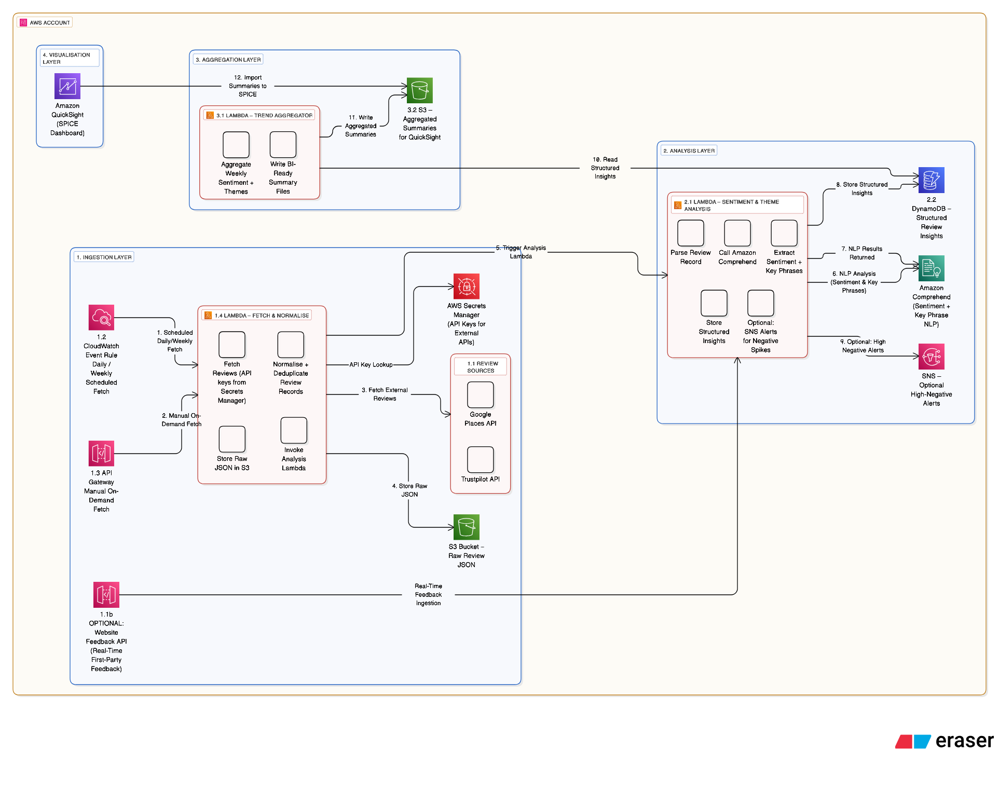

## InsightLens – Problem, Solution & Cost Analysis

_InsightLens is a serverless platform that collects, analyses, and visualises customer reviews using AWS Lambda, Comprehend, DynamoDB, S3, and QuickSight. It enables SMEs to track sentiment trends, recurring issues, and proactively act on feedback without managing infrastructure._

---

### Problem Statement

SMEs face fragmented customer feedback across multiple platforms. Manual analysis is slow, error-prone, and provides limited insight into sentiment trends, recurring issues, or brand health. Businesses struggle to take timely, data-driven action, leading to missed opportunities and poor customer experience.

---

### Solution Architecture

InsightLens leverages **serverless, event-driven AWS architecture** to ingest, process, and visualise customer reviews in near real-time:

- **Data Ingestion**: AWS **API Gateway** triggers **AWS Lambda** functions on schedule (via **EventBridge**) to fetch reviews from **Google Places**, **Trustpilot**, and optional first-party APIs.
- **Security**:
  - API keys and credentials stored in **AWS Secrets Manager**.
  - Lambda functions assigned **least-privilege IAM roles**.
  - Data encrypted in transit (HTTPS) and at rest (**DynamoDB SSE**, **S3 SSE-S3**).
- **Processing & Analytics**:
  - Lambda functions **normalize, deduplicate, and validate** incoming reviews.
  - Sentiment and key-phrase extraction performed using **Amazon Comprehend**.
  - Idempotent processing patterns prevent duplicate ingestion.
- **Data Storage**:
  - Operational data stored in **DynamoDB** using a **single-table design** for predictable performance and cost scaling.
  - Aggregated weekly summaries exported to **S3** for long-term storage and analytics.
- **Visualization & Alerts**:
  - **Amazon QuickSight (SPICE)** dashboards provide trend analysis and KPI monitoring.
  - **Amazon SNS** delivers optional alerts for negative sentiment spikes.
- **Observability & Monitoring**:
  - **CloudWatch Logs and Metrics** track Lambda invocations, errors, and API latencies.
  - Alarms configured for ingestion failures or DynamoDB throttling.
- **Scalability & Availability**:
  - Serverless Lambda scales automatically with workload.
  - DynamoDB partition keys designed for high throughput; multi-AZ redundancy ensures availability.
  - S3 lifecycle policies archive historical data to **S3 Glacier** for cost efficiency.

---

### Cost Considerations

- **AWS Lambda**: Pay-per-use reduces idle compute costs; automatically scales with traffic bursts.
- **DynamoDB**: On-demand capacity mode provides predictable low-latency queries with minimal management.
- **S3 + QuickSight**: Low-cost storage and analytics; lifecycle policies optimise long-term retention.
- **SNS**: Minimal cost for optional alerting; serverless integration reduces operational overhead.

By leveraging **serverless patterns, automated workflows, and managed services**, InsightLens delivers **real-time analytics**, **trend aggregation**, and **proactive alerting**, enabling SMEs to act on insights without managing infrastructure.

---

### Key Architectural Decisions

1. **Serverless over EC2** – reduces operational burden, auto-scales, and minimizes cost.
2. **Single-table DynamoDB** – supports multi-tenant scalability and simplifies queries.
3. **Secrets Manager + IAM best practices** – ensures secure handling of API keys and least-privilege access.
4. **CloudWatch & SNS monitoring** – provides observability, alerting, and resilience.
5. **S3 + QuickSight** – separates operational and analytical workloads for performance and cost efficiency.

---
